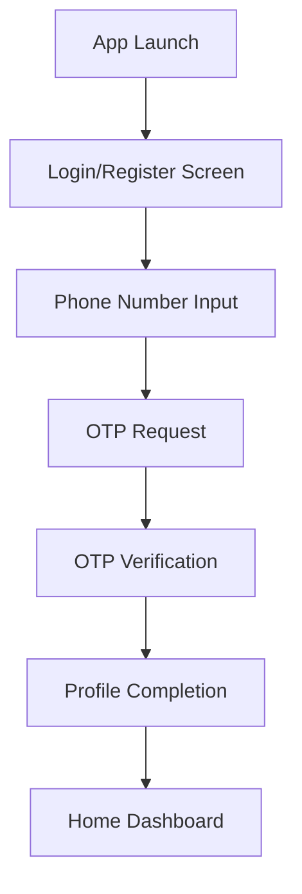
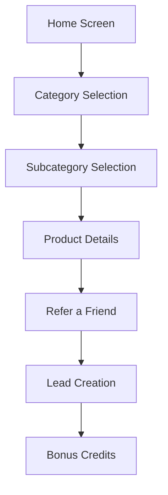
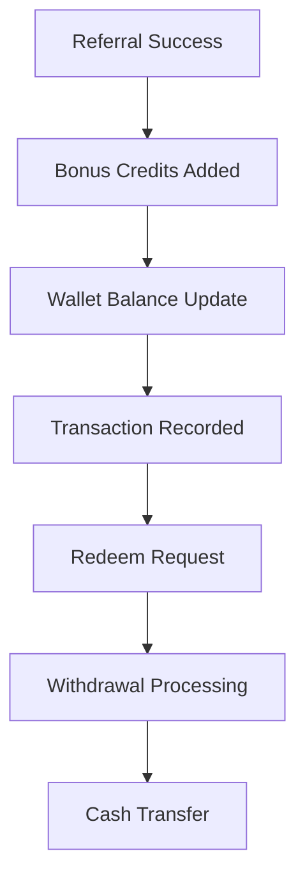
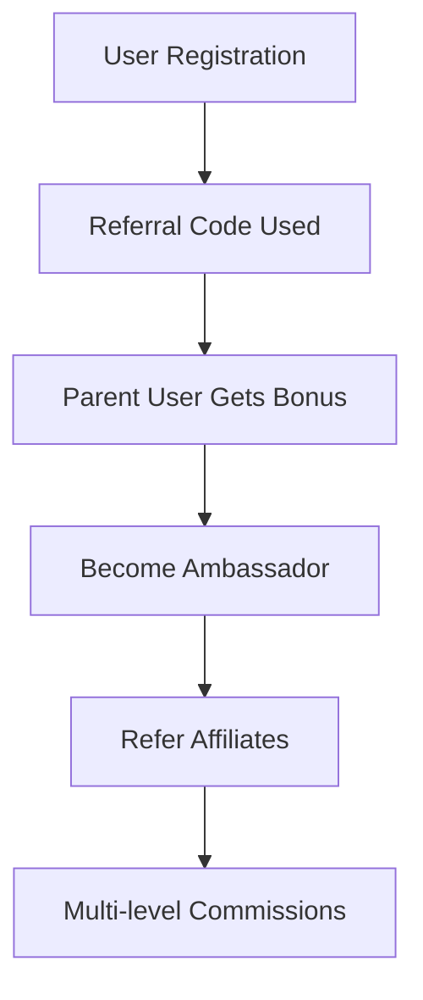

# DrWise User App - Complete API Documentation

## 📋 Table of Contents
1. [App Overview](#app-overview)
2. [Architecture & Tech Stack](#architecture--tech-stack)
3. [API Infrastructure](#api-infrastructure)
4. [Complete API Reference](#complete-api-reference)
5. [Page-by-Page API Usage](#page-by-page-api-usage)
6. [Key Features & Functionality](#key-features--functionality)
7. [Data Flow & User Journey](#data-flow--user-journey)
8. [Configuration & Setup](#configuration--setup)
9. [Error Handling & Best Practices](#error-handling--best-practices)

---

## 🎯 App Overview

**DrWise** is a React Native mobile application built with Expo that serves as an affiliate/referral platform for financial products and services. The app facilitates a multi-level referral system where users can earn coins by referring products/services and build an affiliate network.

### Core Business Model
- **Referral-Based Earnings**: Users earn coins through referrals
- **Affiliate Network**: Multi-level referral system with ambassadors
- **Product Catalog**: Financial products (loans, insurance, investments, etc.)
- **Wallet System**: Coin-based rewards and redemption system
- **Commission Structure**: Different bonus tiers for affiliates

---

## 🏗️ Architecture & Tech Stack

### Frontend
- **Framework**: React Native with Expo
- **Navigation**: Expo Router (file-based routing)
- **UI Library**: Tamagui (React Native UI components)
- **State Management**: React hooks + Context API
- **HTTP Client**: Axios with interceptors
- **Authentication**: JWT tokens stored in AsyncStorage

### Project Structure
```
app/
├── api/                    # API service layer
├── (tabs)/                 # Main tab navigation
├── Register/              # Authentication screens
├── product/               # Product-related screens
├── categories/            # Category browsing
├── profile/               # User profile management
├── referral/              # Referral system
├── redeem/                # Withdrawal system
├── ambasitor/             # Ambassador dashboard
└── context/               # React contexts
```

### Key Dependencies
- `expo-router` - File-based routing
- `tamagui` - UI component library
- `axios` - HTTP client
- `@react-native-async-storage/async-storage` - Local storage
- `react-native-toast-message` - Toast notifications
- `expo-image-picker` - Image handling

---

## 🌐 API Infrastructure

### Base Configuration
```typescript
// apiClient configuration (api/https.tsx)
const apiClient = axios.create({
  baseURL: global.baseURL,  // Centralized base URL
});

// Request interceptor for authentication
apiClient.interceptors.request.use(async (config) => {
  const token = await AsyncStorage.getItem('token');
  if (token) {
    config.headers.Authorization = `Bearer ${token}`;
  }
  return config;
});
```

### Error Handling Pattern
```typescript
// Consistent error handling across all API calls
try {
  const response = await apiClient.post(endpoint, data);
  return response;
} catch (error) {
  throw error;  // Propagated to component level
}
```

---

## 📚 Complete API Reference

### 1. 🔐 Authentication APIs (`api/auth.tsx`)

| Method | Endpoint | Purpose | Parameters | Usage |
|--------|----------|---------|------------|-------|
| `sendOtp` | `POST /auth/send-otp` | Send OTP for login | `{phoneNumber: string}` | Login & Registration |
| `verifyOtp` | `POST /auth/login` | Verify OTP & login | `{phoneNumber: string, otp: string}` | Login & Registration |
| `register` | `POST /auth/register` | User registration | `{name, email, phoneNumber, referralCode, otp}` | Registration |
| `customerLogout` | `POST /auth/logout` | User logout | - | Profile |
| `getUserData` | `GET /auth/get-user` | Fetch user profile | - | Profile, Dashboard |
| `customerLogin` | `POST /customer-login` | Alternative login | `{username, password}` | Alternative auth |

### 2. 👤 User Management APIs (`api/user.tsx`)

| Method | Endpoint | Purpose | Parameters | Usage |
|--------|----------|---------|------------|-------|
| `updateUser` | `PUT /users/update/{id}` | Update user profile | `{id: string, data: object}` | Profile Edit |
| `getUsers` | `GET /users/get-users` | Fetch users list | `{params: object}` | Ambassador Dashboard |
| `createUser` | `POST /user` | Create new user | `{userData: object}` | User creation |

### 3. 🏷️ Product APIs (`api/product.tsx`)

| Method | Endpoint | Purpose | Parameters | Usage |
|--------|----------|---------|------------|-------|
| `getProducts` | `GET /products` | Fetch products list | `{params: object}` | Product browsing |
| `getProductById` | `GET /products/{id}` | Fetch single product | `{id: string}` | Product details |
| `getProductsBySubCategory` | `GET /products/product/{id}` | Products by subcategory | `{id: string}` | Category details |

### 4. 📂 Category APIs (`api/categorys.tsx`)

| Method | Endpoint | Purpose | Parameters | Usage |
|--------|----------|---------|------------|-------|
| `getCategories` | `GET /categories` | Fetch all categories | `{params: object}` | Home screen |
| `getProductByCategory` | `GET /products/category/{id}` | Products in category | `{id: string}` | Category browsing |

### 5. 🏗️ Subcategory APIs (`api/subCategories.tsx`)

| Method | Endpoint | Purpose | Parameters | Usage |
|--------|----------|---------|------------|-------|
| `getSubCategories` | `GET /subcategory` | Fetch subcategories | `{params: object}` | Home screen |

### 6. 💰 Wallet APIs (`api/wallet.tsx`)

| Method | Endpoint | Purpose | Parameters | Usage |
|--------|----------|---------|------------|-------|
| `getWallet` | `GET /wallet` | Fetch wallet balance | - | Credits, Referral pages |
| `updateWallet` | `PUT /wallet/debit` | Debit wallet balance | `{amount: number, description: string}` | Redemption |

### 7. 📊 Transaction APIs (`api/transactions.tsx`)

| Method | Endpoint | Purpose | Parameters | Usage |
|--------|----------|---------|------------|-------|
| `getTransactions` | `GET /wallet/transactions` | Fetch transaction history | - | Transaction history |

### 8. 💸 Withdrawal APIs (`api/withdrawal.tsx`)

| Method | Endpoint | Purpose | Parameters | Usage |
|--------|----------|---------|------------|-------|
| `withdrawalRequest` | `POST /wallet/withdraw-request` | Create withdrawal request | `{amount: number, bankAccountId: number}` | Redeem page |
| `getWithdrawalRequest` | `POST /wallet/withdrawal-request/{id}` | Get withdrawal status | `{id: string}` | Redeem page |

### 9. 👥 Affiliate APIs (`api/affiliate.tsx`)

| Method | Endpoint | Purpose | Parameters | Usage |
|--------|----------|---------|------------|-------|
| `createAffiliate` | `POST /affiliate/affiliate` | Create affiliate relationship | `{affiliateData: object}` | Referral system |
| `getAffiliates` | `GET /affiliate/affiliates` | Fetch affiliates list | `{params: object}` | Profile, Ambassador |

### 10. 🔗 Referral APIs (`api/referral.tsx`)

| Method | Endpoint | Purpose | Parameters | Usage |
|--------|----------|---------|------------|-------|
| `getReferral` | `GET /referral` | Fetch referral data | - | Referral page |

### 11. 🛠️ Lead APIs (`api/lead.tsx`)

| Method | Endpoint | Purpose | Parameters | Usage |
|--------|----------|---------|------------|-------|
| `createLead` | `POST /leads` | Create new lead | `{name, email, phone, ...}` | Referral forms |
| `getLeads` | `GET /leads` | Fetch leads list | `{params: object}` | Lead management |

### 12. 📈 Sales APIs (`api/sale.tsx`)

| Method | Endpoint | Purpose | Parameters | Usage |
|--------|----------|---------|------------|-------|
| `getSales` | `GET /sale` | Fetch sales data | `{params: object}` | Sales reporting |

### 13. ⚙️ Configuration APIs (`api/configuration.tsx`)

| Method | Endpoint | Purpose | Parameters | Usage |
|--------|----------|---------|------------|-------|
| `getconfig` | `GET /config/get-configs` | Fetch app configuration | - | Global settings |

---

## 📱 Page-by-Page API Usage

### 1. **Login Screen** (`app/Register/login.tsx`)
```typescript
// API Calls:
- sendOtp({ phoneNumber })     // Send OTP to user
- verifyOtp({ phoneNumber, otp }) // Verify OTP & login
- getUserData()                // Get user profile after login
```

**Purpose**: OTP-based authentication flow

### 2. **Registration Screen** (`app/Register/register.tsx`)
```typescript
// API Calls:
- register(userData)           // Create new user account
- sendOtp({ phoneNumber })     // Send verification OTP
- verifyOtp({ phoneNumber, otp }) // Verify OTP
- getUserData()                // Get user data after registration
```

**Purpose**: User onboarding with referral code validation

### 3. **Home/Dashboard** (`app/(tabs)/index.tsx`)
```typescript
// API Calls:
- getUserData()                // User profile & roles
- getconfig()                  // App configuration & featured images
- getCategories()              // Main categories
- getSubCategories()           // Subcategories with pagination
```

**Purpose**: Main dashboard with product catalog and user info

### 4. **Profile Screen** (`app/(tabs)/profile.tsx`)
```typescript
// API Calls:
- getUserData()                // User profile data
- getAffiliates({ referredBy: userId }) // User's referrals
- updateUser(userId, imageData) // Profile image update
- customerLogout()             // User logout
```

**Purpose**: User profile management and referral tracking

### 5. **Credits/Wallet Screen** (`app/(tabs)/credit.tsx`)
```typescript
// API Calls:
- getWallet()                  // Wallet balance
- getTransactions()            // Transaction history
- getUserData()                // User information
```

**Purpose**: Financial overview and transaction history

### 6. **Referral Screen** (`app/(tabs)/referral.tsx`)
```typescript
// API Calls:
- getWallet()                  // Current coin balance
- getUserData()                // User referral code
- getconfig()                  // Ambassador role configuration
```

**Purpose**: Referral code sharing and bonus information

### 7. **Product Details** (`app/product/productDetails.tsx`)
```typescript
// API Calls:
- getProductById(productId)    // Product information
```

**Purpose**: Product information and referral initiation

### 8. **Category Details** (`app/categories/categoriesDetails.tsx`)
```typescript
// API Calls:
- getProductsBySubCategory(subCatId) // Products in subcategory
```

**Purpose**: Product browsing within categories

### 9. **Redeem/Withdrawal** (`app/redeem/redeem.tsx`)
```typescript
// API Calls:
- getUserData()                // User profile completeness check
- getWallet()                  // Current balance
- getconfig()                  // Joining bonus configuration
- getWithdrawalRequest(userId) // Check pending withdrawals
- withdrawalRequest(amountData) // Create withdrawal request
```

**Purpose**: Coin redemption to cash

### 10. **Ambassador Dashboard** (`app/ambasitor/ambasitorDashboard.tsx`)
```typescript
// API Calls:
- getUserData()                // Ambassador profile
- getUsers({ ambassadorId, page, limit }) // Ambassador's affiliates
```

**Purpose**: Affiliate network management

### 11. **Referral Form** (`app/referral/referralForm.tsx`)
```typescript
// API Calls:
- createLead(leadData)         // Create referral lead
```

**Purpose**: Submit product referrals

### 12. **Affiliate Referrals** (`app/affliliate/affliliatesReferals.tsx`)
```typescript
// API Calls:
- getUsers({ referredBy: affiliateId }) // Affiliate's referrals
```

**Purpose**: Track affiliate performance

---

## 🚀 Key Features & Functionality

### Core Features

#### 1. **Multi-Level Referral System**
- **User Registration**: Referral code validation during signup
- **Coin Rewards**: Automatic bonus credits for successful referrals
- **Ambassador Program**: Higher-tier affiliates with additional benefits
- **Commission Tracking**: Real-time earning calculations

#### 2. **Product Catalog Management**
- **Hierarchical Structure**: Categories → Subcategories → Products
- **Dynamic Content**: Base64 image support for product images
- **Referral Integration**: Direct referral initiation from product pages

#### 3. **Financial Management**
- **Wallet System**: Coin-based balance tracking
- **Transaction History**: Complete audit trail of all transactions
- **Withdrawal System**: Secure redemption process
- **Bonus System**: Joining bonuses, referral bonuses, unlocked bonuses

#### 4. **User Profile Management**
- **Profile Completion**: Mandatory fields for withdrawal eligibility
- **Image Upload**: Profile picture management with camera/gallery options
- **Verification Status**: Phone number and email verification tracking

### Advanced Features

#### 1. **Role-Based Access**
```typescript
// Ambassador role checking
const isAmbassador = userRoles.some(role => role._id === ambassadorRoleId);
```

#### 2. **Smart Caching & Performance**
- AsyncStorage for offline data persistence
- Pull-to-refresh functionality
- Pagination for large datasets
- Optimized image loading

#### 3. **Error Handling & UX**
- Toast notifications for all API responses
- Loading states for all async operations
- Graceful error recovery
- User-friendly error messages

---

## 🔄 Data Flow & User Journey

### 1. **User Onboarding Journey**


### 2. **Product Referral Flow**


### 3. **Earnings & Redemption Flow**


### 4. **Affiliate Network Flow**


---

## ⚙️ Configuration & Setup

### App Configuration (`app.json`)
```json
{
  "expo": {
    "name": "DrWise",
    "slug": "drwise-user",
    "scheme": "drwise",
    "version": "1.0.0",
    "orientation": "portrait"
  }
}
```

### Environment Configuration (`app/Utils/global.tsx`)
```typescript
// Global configuration
export default {
  baseURL: "YOUR_API_BASE_URL",  // Backend API URL
  // Other global constants
};
```

### Toast Configuration (`app/toast/toastConfig.tsx`)
```typescript
// Custom toast styling and behavior
export default {
  success: { /* success toast config */ },
  error: { /* error toast config */ },
  info: { /* info toast config */ }
};
```

---

## 🛡️ Error Handling & Best Practices

### Error Handling Patterns
```typescript
// Consistent error handling across components
try {
  const response = await apiFunction(params);
  // Handle success
} catch (error) {
  Toast.show({
    type: 'error',
    text1: error?.response?.data?.message || 'Unexpected Error',
    position: 'bottom',
  });
}
```

### Loading States
```typescript
// Loading state management
const [loading, setLoading] = useState(false);

// In async functions
setLoading(true);
try {
  await apiCall();
} finally {
  setLoading(false);
}
```

### Data Validation
```typescript
// Form validation with react-hook-form
const { control, handleSubmit, formState: { errors } } = useForm<FormData>({
  defaultValues: { /* default values */ }
});

// Field-level validation rules
rules={{
  required: 'Field is required',
  pattern: { value: regex, message: 'Invalid format' }
}}
```

### Security Best Practices
- JWT token automatic refresh
- Secure token storage with AsyncStorage
- Request/response interceptors
- Input validation and sanitization
- API endpoint protection

---

## 📊 Database Schema Relationships

### Core Entities
```
User
├── _id (ObjectId)
├── name (String)
├── email (String)
├── phoneNumber (String)
├── roles (Array<ObjectId>)
├── referralCode (String)
├── referredBy (ObjectId)
├── image (Base64 String)
├── verified (Boolean)
└── createdAt (Date)

Category
├── _id (ObjectId)
├── name (String)
├── description (String)
└── createdAt (Date)

SubCategory
├── _id (ObjectId)
├── name (String)
├── description (String)
├── image (Base64 String)
├── parentCategory (ObjectId → Category)
└── createdAt (Date)

Product
├── _id (ObjectId)
├── name (String)
├── description (String)
├── benefits (Array<String>)
├── categoryId (ObjectId → Category)
└── createdAt (Date)

Wallet
├── _id (ObjectId)
├── userId (ObjectId → User)
├── balance (Number)
├── lockedRefBonus (Number)
└── updatedAt (Date)

Transaction
├── _id (ObjectId)
├── userId (ObjectId → User)
├── type (Enum: credit, debit, JOINING_BONUS, etc.)
├── amount (Number)
├── description (String)
├── transactionId (String)
├── status (String)
└── date (Date)

Lead
├── _id (ObjectId)
├── name (String)
├── email (String)
├── phone (String)
├── referredBy (ObjectId → User)
├── productId (ObjectId → Product)
├── status (String)
└── createdAt (Date)
```

---

## 🔧 Development & Deployment

### Development Setup
```bash
# Install dependencies
npm install

# Start development server
npm start

# Run on specific platform
npm run android
npm run ios

# Build for production
eas build --platform android
eas build --platform ios
```

### Key Development Patterns
1. **File-based Routing**: Expo Router for navigation
2. **Component Composition**: Reusable UI components with Tamagui
3. **Custom Hooks**: Business logic separation
4. **Context API**: Global state management
5. **Error Boundaries**: Graceful error handling

### Performance Optimizations
- **Lazy Loading**: Components loaded on demand
- **Image Optimization**: Base64 and optimized loading
- **Pagination**: Large dataset handling
- **Caching**: AsyncStorage for offline data
- **Memoization**: React.memo for expensive components

---

## 📈 Future Enhancements

### Potential Improvements
1. **Push Notifications**: Real-time referral updates
2. **Offline Mode**: Cached data for offline browsing
3. **Biometric Authentication**: Enhanced security
4. **Advanced Analytics**: Detailed earning reports
5. **Social Sharing**: Integrated social media sharing
6. **Multi-language Support**: Internationalization
7. **Dark Mode**: Theme switching capability
8. **Advanced Filtering**: Product search and filters

### Scalability Considerations
- **API Rate Limiting**: Prevent abuse
- **Database Indexing**: Optimize query performance
- **CDN Integration**: Faster image loading
- **Caching Layer**: Redis for session management
- **Microservices**: Separate services for different domains

---

*This documentation provides a comprehensive overview of the DrWise user application architecture, API structure, and functionality. For specific implementation details or modifications, refer to the individual component files in the codebase.*


